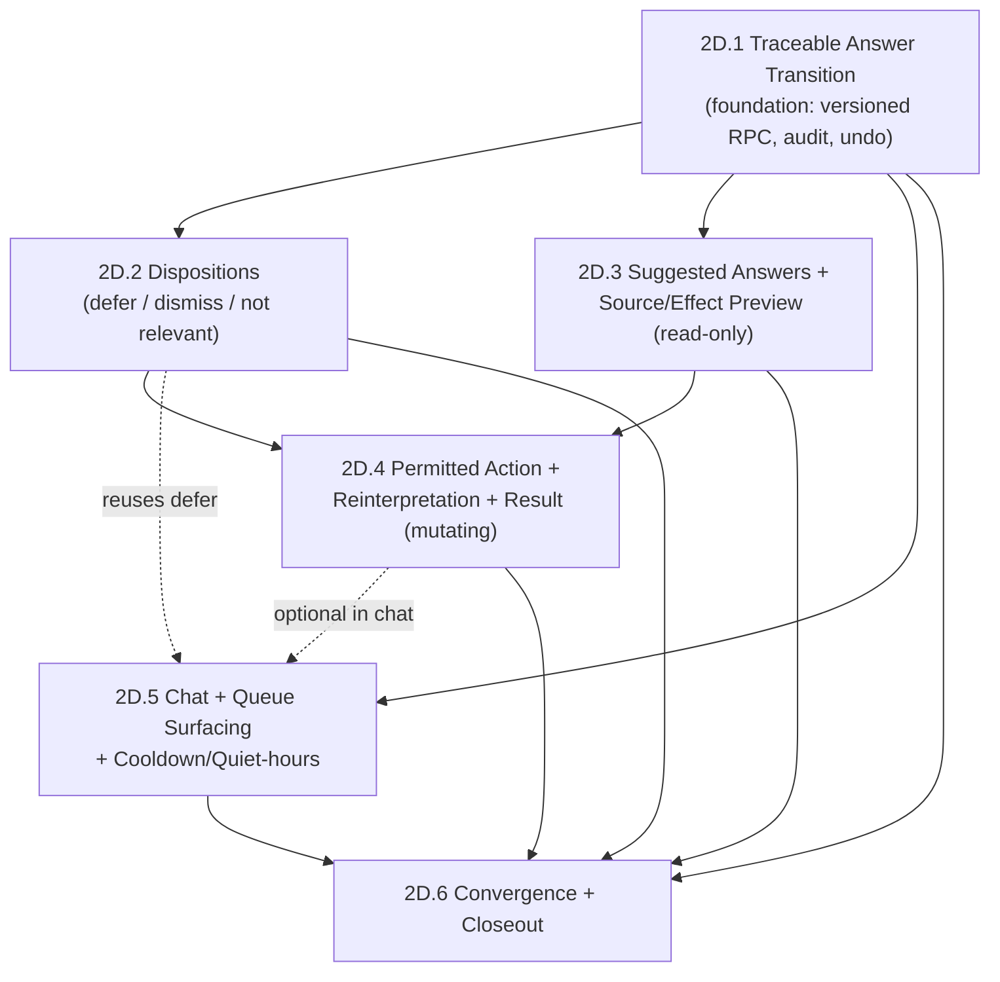

# Phase 2D — Conversational Pending Questions — Implementation Plan

> **For agentic workers:** REQUIRED SUB-SKILL: Use `superpowers:subagent-driven-development` or `superpowers:executing-plans` only after the user authorizes a Phase 2D feature branch and implementation. Steps use checkbox (`- [ ]`) syntax for execution tracking. This document is a plan; it authorizes no branch, migration, remote mutation, deployment, push, or PR.

**Goal:** Turn a pending question from a dead-end free-text `UPDATE` into a traceable, reversible domain transition — answered, deferred, dismissed, or marked not relevant — that can preview its source and effect, optionally trigger a bounded reinterpretation, and be resolved from Chat and the queue, all owner-scoped, audited, undoable, and privacy-safe.

**Architecture:** Keep the immutable interpretation (and its `pending_questions` JSON) as evidence. Carry resolution *state* on the existing `pending_questions` row and *evidence* on append-only audit/undo rows, reusing the Phase 2C versioned-RPC, canonical-fingerprint, and undo patterns. Reinterpretation reuses the deployed `enqueue_entry_reprocessing`/correction/worker path — no new engine, queue, or worker. Add one strict versioned `SECURITY DEFINER` RPC per contract change, preserve the legacy answer path during rollout, and cut consumers over only after the remote contract is proved.

**Tech Stack:** Next.js 16.2.10 App Router and Server Actions, React 19.2.4 `useActionState`, strict TypeScript, Zod 4.4.3, next-intl 4.13.2, Supabase/PostgreSQL/RLS/RPC, generated Supabase types, Vitest/Testing Library, pgTAP, disposable Node remote smokes, and Playwright 1.61.1.

## Global constraints

- This plan implements [`PHASE_2D_PRD.md`](./PHASE_2D_PRD.md); the PRD wins if wording here is accidentally broader.
- Phase 2D.1 resolves an answer only — no AI, suggested answers, preview, consequence, disposition, or chat.
- No question-draft table, autosave, local-storage draft, or offline question editor is permitted. `pending_questions` carries state; append-only rows carry evidence; the interpretation carries provenance.
- The immutable interpretation `pending_questions` JSON and extracted `question`/`reason` are never edited in place.
- Migrations are append-only. Never edit an applied migration; the newest applied number at planning time is `202607220045`.
- Preserve the current answer path (`answerPendingQuestion` behavior) until its removal is separately authorized after all consumers are gone.
- Sensitive writes are database-owned, authenticated through `auth.uid()`, explicitly owner-scoped, RLS-protected, `SECURITY DEFINER` with `set search_path = ''`, least-privilege grants, qualified references, and no dynamic SQL.
- No arbitrary action object, owner id, dynamic SQL, raw provider response, or product-event content is accepted.
- Reinterpretation reuses the deployed worker/dispatch; no Edge Function, queue, worker, scheduler, secret, Auth, email, or provider change is part of Slices 2D.1–2D.2. Slice 2D.3 generates suggested answers deterministically with no AI schema or worker change; an additive, validated extraction-schema field is a later fallback only if deterministic suggestions prove insufficient, under separate authorization.
- All resolution kinds flow through one long-lived versioned RPC family, `resolve_pending_question_vN`; a new version is added only when the closed input shape must change. Separate answer/disposition RPC families are not created unless a future contract genuinely requires separation.
- Analytics remains allowlisted, content-free, and fail-open.
- Each slice ships PT-BR/English, desktop/mobile, keyboard/focus/live-region, local tests, database evidence where applicable, remote smoke, rollback, cleanup, traceability, and current documentation.
- Before editing any Next.js file during execution, read the relevant installed guides in `node_modules/next/dist/docs/` (Server Actions and forms) as required by `AGENTS.md`.
- Every slice requires explicit authorization before its feature branch, local implementation, remote mutation, deployment, push, or PR. This planning task stops before branch creation.

---

## 1. Verified baseline at planning time

- Planning inspected `main` at `6974459` (Phase 2C merged via PR #10), clean, equal to `origin/main`. Newest applied migration is `202607220045`.
- `public.pending_questions` exists with `status ∈ ('open','answered','dismissed','snoozed')`, `answer`, `snoozed_until`, `answered_at`, `unique (interpretation_id, candidate_index)`, index `(user_id, status, created_at desc)`, RLS enabled. The `snoozed`/`dismissed` statuses and `snoozed_until` are present but unused by any application code.
- `public.normalize_pending_questions()` materializes questions from the immutable interpretation on insert; new interpretations produce new question rows.
- `answerPendingQuestion` (`src/features/agent/actions.ts`) is a plain owner-scoped `UPDATE` to `status='answered'` guarded by `status='open'`, emitting fail-open `question_answered_basic` (empty props). No RPC, audit, or undo.
- `src/app/[locale]/app/questions/page.tsx` lists open questions with `QuestionAnswerForm` (`src/features/agent/forms.tsx`).
- Reinterpretation infra: `correct_entry_interpretation` (conflict `55P03`, ADR-026), `enqueue_entry_reprocessing`, deployed worker `supabase/functions/process-jobs/entry.ts`, `undo_operation(p_undo_id)`. `undo_operation`'s own `40001` conflict path is an unresolved residual risk (`2C-UNDO-004`, `SECURITY.md`).
- `agent_preferences`: `quiet_start`, `quiet_end`, `important_reminder_override`, `max_followups_per_day`; heartbeat (`run_all_heartbeats`) is deterministic, per-user, timezone-aware, quiet-hours/cap/cooldown-aware, failure-isolated.
- `undo_operations` has the additive `request_fingerprint` column and operation-key namespacing; `audit_logs` is append-only; `entry_task_candidate_resolutions` demonstrates the narrow non-materializing ledger pattern.
- Product ledger allowlists 19 events (version 1) including `question_answered_basic`; content is forbidden; fail-open.
- `src/features/chat/*` renders grounded chat with sources-as-untrusted-data; it does not render or resolve pending questions.
- Quality commands: `npm test`, `npm run lint`, `npm run typecheck`, `npm run build`, `npm run test:e2e`, focused remote scripts, and phase aggregates.

## 2. Delivery order and commit policy

Official slices:

1. **2D.1 — Traceable Answer Transition**
2. **2D.2 — Question Dispositions (Defer, Dismiss, Not Relevant)**
3. **2D.3 — Suggested Answers and Source/Effect Preview**
4. **2D.4 — Permitted Action, Reinterpretation, and Result**
5. **2D.5 — Conversational Surfacing (Chat + Queue) and Cooldown**
6. **2D.6 — Convergence and Closeout**

Each slice targets one focused implementation commit. A slice may use two commits only when an additive database contract must be deployed and remotely proved before switching its consumer (the Phase 2C `feat(db): …` then `feat(<feature>): …` split). The migration commit must be deployable without the UI commit; the UI commit must be rollback-safe to the prior contract without reverting the migration. Database defects are forward-fixed with new migrations, never by editing an applied one.

## 3. Cross-slice file and boundary map

| Area | Owner | Responsibility |
| --- | --- | --- |
| Immutable question | `entry_interpretations.pending_questions` | AI evidence; never edited by Phase 2D |
| Question state | `public.pending_questions` | Current resolution state + answer content; owner-scoped, RLS |
| Resolution command | `src/features/agent/question-resolution-contract.ts` (new) | Closed Zod schema, normalized resolution/consequence, bounded serialization |
| Server boundary | `src/features/agent/actions.ts` | Auth, FormData parsing, sanitization, versioned RPC call, action-result mapping, revalidation, fail-open event |
| Transaction | new migrations + versioned RPCs | Ownership, locks, closed JSON validation, stale/current check, canonical replay, state/consequence/audit/undo atomics |
| Operation evidence | `undo_operations`, `audit_logs`, optional resolution ledger | Fingerprint, resolution kind, consequence, undo compensation |
| Reinterpretation | `enqueue_entry_reprocessing`/correction + worker | The only durable consequence; reused, not reimplemented |
| Question UI | `src/app/[locale]/app/questions/page.tsx`, `src/features/agent/forms.tsx`, new resolution components | Answer/defer/dismiss/preview controls |
| Chat surface | `src/features/chat/*` | Render questions as untrusted-data interactive elements; reuse resolution contract |
| Surfacing/cooldown | new deterministic module aligned with heartbeat | Quiet-hours/cap/cooldown gating for proactive surfacing |
| Analytics | `src/features/product-analytics/*` + migration allowlist | Content-free resolution/preview/consequence events |
| Daily convergence | Needs Attention, review, queue, questions page, Chat | A resolved question is consistently actionable/removed across surfaces |

---

## 4. Phase 2D.1 — Traceable Answer Transition

### 4.1 User outcome
The user answers an open, current pending question in natural language and the answer is recorded as an owner-scoped, atomic, audited, undoable transition. Answering a stale question, a non-owned question, or a non-open question fails safely. Nothing else in the Brain changes yet.

### 4.2 Included / excluded
Included: versioned `SECURITY DEFINER` resolution RPC for `answer`; stale/current interpretation check under owner lock; closed command; canonical replay fingerprint; atomic state + audit + undo; stable localized action-result codes; content-free fail-open analytics reusing `question_answered_basic`; local, pgTAP/equivalent, linked remote, desktop/mobile PT-BR/English gates.
Excluded: suggested answers, source/effect preview, any consequence/reinterpretation, defer/dismiss/not-relevant, chat rendering, cooldown/surfacing, extraction-schema change, Edge Function/worker/queue/secret change.

### 4.3 Exact public database contract
Add an append-only migration `supabase/migrations/2026072x0046_phase_2d_resolve_pending_question.sql` (assign the next monotonic number at authorized preflight; never reuse/edit an applied one).

Introduce the single long-lived resolution RPC family with this exact name and argument contract (final signature confirmed at RED pgTAP). Slice 2D.1 accepts only the `answer` resolution kind; later slices bump to `_v2`/`_v3` within the same family to add kinds and a consequence — never a separate `answer_*` family.

```sql
public.resolve_pending_question_v1(
  p_question_id uuid,
  p_resolution jsonb,   -- closed, discriminated: 2D.1 accepts only { "kind": "answer", "answer": <text> }
  p_operation_key text
) returns jsonb
```

`language plpgsql`, `security definer`, `set search_path = ''`. Grant execute to `authenticated` only; revoke from `public`/`anon`. Owner from `auth.uid()`; qualified `public.*`/`extensions.*` names.

`p_resolution` closed-shape rules (2D.1): keys exactly `kind`, `answer`; `kind` must equal `"answer"`; any other kind, unknown key, or extra nesting rejects the transaction with `22023`. This leaves room for `_v2` to add `deferred`/`dismissed`/`not_relevant` and `_v3` to add an optional `consequence` without a new family.

Behavior:
- validate/normalize the operation key (length 8–240) and the resolution (`kind='answer'`; answer trimmed, 1–4000 chars); reject empty/whitespace/overlong/unknown-kind;
- load the owner-scoped question by `(user_id, id)`; reject not-found and non-`open` status without cross-owner disclosure;
- resolve the question's `entry_id`/`interpretation_id`; lock the owned entry `for update`; require `entries.current_interpretation_id = pending_questions.interpretation_id`, else map stale to SQLSTATE `55P03`;
- canonicalize `{questionId, kind, answer}` (trimmed/normalized) and compute a lowercase SHA-256 hex fingerprint with `extensions.digest`/`extensions.encode` (stop for a database decision if absent — do not substitute MD5);
- reserve/resolve the owner-scoped `undo_operations(user_id, operation_key)` unique key namespaced `resolve-v1:`; same fingerprint replays the original result, different fingerprint raises the sanitized idempotency mismatch;
- for a new operation: set `status='answered'`, `answer`, `answered_at=now()`; write one audit row (question id, interpretation id, resolution kind, fingerprint); finalize the reserved undo row;
- return `{ "question_id": uuid, "resolution": "answered", "undo_id": uuid, "idempotent": bool }`.

Stable database failure contract (Server Action maps to localized codes; never returns raw text):
- `42501` unauthenticated/forbidden; `P0002` owner-scoped question not found; `55P03` stale interpretation; `55000` question not open; `22023` malformed input; `P0001` + `2D_IDEMPOTENCY_MISMATCH` same key/different payload.

### 4.4 Idempotency and undo
Reuse the Phase 2C fingerprint mechanism and `undo_operations.request_fingerprint`. Undo (`undo_operation`) restores `status='open'`, clears `answer`/`answered_at`, records audit evidence, and is idempotent. No new undo architecture. No confirmation/resolution table is required for 2D.1 (state lives on `pending_questions`; evidence on audit/undo).

### 4.5 Server/client contracts
Create `src/features/agent/question-resolution-contract.ts` with a discriminated `QuestionResolutionCommand` whose 2D.1 variant is `{ questionId: string; kind: "answer"; answer: string }` (the discriminant leaves room for later kinds without a new module), a strict Zod schema, a normalizer that serializes the closed `p_resolution` JSON, and unit tests for empty/whitespace/overlong/valid/unknown-kind. Extend the action result to a discriminated code: `validation_error`, `session_expired`, `stale_interpretation`, `not_open`, `idempotency_mismatch`, `retryable_failure`, `resolution_succeeded`. Rewrite `answerPendingQuestion` (retaining the exported name until cutover) to parse the command, call `resolve_pending_question_v1`, map failures to stable codes/copy, preserve the operation key on retry, revalidate `/questions` (and Needs Attention/Home), and keep telemetry outside domain authority.

### 4.6 Likely files
Create: the migration; `supabase/tests/resolve_pending_question.sql`; `scripts/remote-question-resolution-smoke.mjs`; `src/features/agent/question-resolution-contract.ts` (+ test); `docs/reports/PHASE_2D_SLICE_01_REPORT.md`.
Modify: `src/features/agent/actions.ts` (+ `answer-pending-question.test.ts`); `src/features/agent/forms.tsx` (+ test) for the new result codes/live regions; `src/lib/supabase/database.types.ts` after linked migration; `scripts/remote-supabase-smoke.mjs` only to add the focused aggregate after the dedicated smoke is green; `e2e/intelligent-capture.spec.ts` (pending-question scenario); `package.json` (`test:remote:2d:resolution`); permanent docs after evidence exists.

### 4.7 Test-first execution tasks
- [ ] Authorized preflight: branch (`codex/phase-2d-slice-1`), branch/HEAD/worktree/migration-tail checks, read Next.js guides.
- [ ] RED: typed-contract tests (empty/whitespace/overlong/valid); action-result mapping tests for each code.
- [ ] RED/GREEN pgTAP: exact `resolve_pending_question_v1` signature, `SECURITY DEFINER`, empty `search_path`, grants, closed `p_resolution` shape (answer-only, unknown-kind rejected), owner/stale/not-open/replay/mismatch/atomicity/audit/undo; confirm `extensions.digest` exists.
- [ ] Implement migration minimally to green; run existing pending-question/interpretation suites to prove no regression; commit `feat(db): add versioned question resolution contract`.
- [ ] Authorized linked apply + parity + lint + regenerate types + dedicated disposable remote smoke (two users, race clients, fail-closed cleanup); verify legacy answer path still works.
- [ ] GREEN: rewrite the Server Action + form; focused Vitest; extend Playwright pending-question scenario (answer, undo, stale conflict copy, PT-BR/en, desktop/Pixel 7, keyboard/focus/live-region).
- [ ] Full gates; cut UI to `resolve_pending_question_v1` only after remote green; commit `feat(agent): resolve questions through an audited transition`.
- [ ] Slice report + permanent-doc updates for proven behavior only; independent product + database/security review; fix critical/important; stop before 2D.2.

---

## 5. Phase 2D.2 — Question Dispositions (Defer, Dismiss, Not Relevant)

### User outcome
The user can resolve an open question without answering it: defer it to a chosen time, dismiss it, or mark it not relevant — each audited and undoable, with truthful history and queue convergence.

### Included / excluded / dependencies
- Include `deferred` (snoozed + validated future `snoozed_until`), `dismissed`, and `not_relevant`; deterministic snooze reactivation to `open`; atomic audit/undo; queue convergence.
- Exclude answers (2D.1), suggestions/preview, reinterpretation, chat.
- Depend on the closed, remotely proved 2D.1 resolution boundary.

### Contract work
- Extend the **same** resolution family by bumping to `resolve_pending_question_v2`, whose closed `p_resolution` adds `{ kind: 'deferred', snoozedUntil }`, `{ kind: 'dismissed' }`, and `{ kind: 'not_relevant' }` alongside the existing `answer` kind; reuse the `undo_operations` fingerprint and the single `resolve-v1:`/`resolve-v2:` namespace. Do not create a separate disposition RPC family.
- Decide `not_relevant` representation (open decision #1 in the PRD). **Plan default:** reuse the existing `dismissed` status and record the distinct `not_relevant` kind on the resolution/audit evidence, avoiding a `status` `CHECK` migration; if product requires a first-class status, add an additive `CHECK` change and regenerate types.
- Add deterministic snooze reactivation. **Plan default:** compute reactivation at read time in the projections (a `snoozed` question with `snoozed_until <= now()` is treated as `open`), plus an optional heartbeat-aligned sweep; avoid a new cron in this slice.
- Update the questions page/forms, Needs Attention/queue projections, generated types, product-event allowlist (proposed `question_resolved` with bounded `kind` only), pgTAP, remote smoke, E2E, `docs/reports/PHASE_2D_SLICE_02_REPORT.md`.

### Boundaries / security / idempotency / analytics
- Only `open → deferred|dismissed|not_relevant` and automatic `snoozed → open`; reject terminal-to-terminal.
- Owner/stale/current checks, canonical fingerprint, and undo mirror 2D.1.
- `question_resolved` records a bounded `kind` enum only — never question/answer content; fail-open. Confirm the privacy granularity at review.

### DoD
One explicit non-answer resolution per open question, deterministic reactivation, truthful history, queue convergence, undo to `open`, no content duplication/analytics, all 2D.1 guarantees still green. Stop before 2D.3.

---

## 6. Phase 2D.3 — Suggested Answers and Source/Effect Preview

### User outcome
The user sees where a question came from and one-tap AI-suggested answers, plus a read-only preview of what answering would change — before committing.

### Included / excluded / dependencies
- Include bounded suggested-answer options, a read-only source view (originating entry/interpretation/candidate), and a read-only predicted-effect preview.
- Exclude applying any consequence (that is 2D.4), dispositions, chat.
- Depend on 2D.1 (answer path) and 2D.2 (resolution surface).

### Contract work
- Suggested answers (confirmed decision #2). **Default: deterministic generation, no AI schema change.** Add a pure `src/features/agent/question-suggestions.ts` module that maps the question's type/shape (e.g. yes-no, which-date, which-person/project, which-context) plus existing owned domain context (the user's projects/people/contexts and the entry's own extracted candidates) to a bounded, closed set of suggested-answer options, with a safe empty fallback. No provider, worker, or extraction-schema change. An additive, optional, Zod + Structured-Outputs-validated `suggestedAnswers` schema field is a **later fallback only** if deterministic suggestions prove insufficient, and only under separate authorization.
- Add an owner-scoped, read-only preview projection (`src/features/agent/question-preview-projection.ts`) returning bounded DTOs for source + predicted effect; never persists.
- Update the question components for suggestion chips (accept → populate editable answer + provenance flag; never auto-submit) and the source/effect panel; product-event `question_effect_previewed` (no properties, best-effort, session-deduplicated); pgTAP/remote/E2E; `docs/reports/PHASE_2D_SLICE_03_REPORT.md`.

### Boundaries / security / idempotency / analytics
- Suggested answers are bounded/closed and inserted as untrusted data; they cannot inject instructions into the resolution path.
- Preview and source are strictly non-mutating (no write/enqueue/lifecycle change).
- Accepting a suggestion sets an `origin: suggested` provenance flag consumed by 2D.1's contract (additive, backward-compatible); the answer text remains user-editable.
- Analytics stays content-free.

### DoD
Suggestions are deterministic (no AI schema/worker change) and never auto-apply; preview/source are accurate and read-only; provenance distinguishes typed vs suggested; all earlier guarantees green. Stop before 2D.4.

---

## 7. Phase 2D.4 — Permitted Action, Reinterpretation, and Result

### User outcome
Answering can trigger exactly one bounded consequence — reinterpretation — applied atomically with the answer, shown as a truthful result, and fully undoable.

### Included / excluded / dependencies
- Include a closed consequence enum (`none`, `reinterpret`); atomic application through the existing `enqueue_entry_reprocessing`/correction path; idempotent per operation key; a visible result; undo compensation.
- Exclude any new consequence type, a general action agent, chat.
- Depend on 2D.1–2D.3 (answer + preview) and the existing reprocessing/correction/worker/undo infrastructure.

### Contract work
- Bump the same resolution family to `resolve_pending_question_v3`, whose closed `p_resolution` carries an optional `consequence` from the closed enum (`none`, `reinterpret`), reusing the deployed reprocessing/correction path inside the same transaction boundary; do not add a new engine/queue/worker or a separate consequence RPC family.
- **Hard gate:** resolve the `undo_operation` SQLSTATE `40001` residual (`2C-UNDO-004`) — forward-fix to `55P03` mirroring ADR-026 — or prove the reinterpretation undo path safe, before remote acceptance.
- Update result surfacing (no internal ids as instructions), generated types, product-event `question_reinterpret_applied` (boolean-by-existence), pgTAP, remote smoke, E2E, `docs/reports/PHASE_2D_SLICE_04_REPORT.md`.

### Boundaries / security / idempotency / analytics
- Consequence is user-initiated only; bounded/closed enum; idempotent and never double-applied on replay/concurrency; no reinterpretation loop (dedupe via existing reprocessing idempotency).
- Undo reverses the answer and compensates the reinterpretation; never edits/resurrects a later revision arbitrarily.
- Analytics records a boolean/count only.

### DoD
Exactly one bounded consequence applies atomically/idempotently through the reused path; the result is truthful; undo is proven (including the `40001` gate); all earlier guarantees green. Stop before 2D.5.

---

## 8. Phase 2D.5 — Conversational Surfacing (Chat + Queue) and Cooldown

### User outcome
Questions render and resolve identically in Chat and the "Precisa de você" queue, and proactive surfacing respects quiet hours, cap, and cooldown.

### Included / excluded / dependencies
- Include Chat rendering of open questions as untrusted-data interactive elements answerable/deferrable through the existing resolution contract; queue/questions-page/Chat convergence; deterministic quiet-hours/cap/cooldown gating for any proactive surfacing.
- Exclude a multi-turn dialog agent, follow-up question generation, new outbound channels (push/email/etc.), and auto-answering.
- Depend on 2D.1–2D.4 resolution contracts and `agent_preferences`/heartbeat semantics.

### Contract work
- Render questions in `src/features/chat/*` from bounded server-side DTOs; question/answer text inserted as data, never instructions; reuse the resolution Server Action.
- Add a deterministic surfacing/cooldown module aligned with the heartbeat's per-user local-time discipline (quiet hours, `max_followups_per_day`, rolling cooldown, `important_reminder_override`, failure isolation). **Plan default:** pull-based surfacing gated by this module; no new cron/notification channel unless separately authorized.
- Update Chat/queue components, product-event `needs_attention_item_opened` reuse where applicable, pgTAP/remote/E2E, `docs/reports/PHASE_2D_SLICE_05_REPORT.md`.

### Boundaries / security / idempotency / analytics
- Prompt-injection boundary preserved; suggested answers and questions are data.
- Surfacing decisions are deterministic and per-user; no LLM decides timing.
- Analytics content-free and fail-open.

### DoD
Chat and queue converge on resolution state; surfacing honors quiet hours/cap/cooldown/override deterministically and is failure-isolated; all earlier guarantees green. Stop before 2D.6.

---

## 9. Phase 2D.6 — Convergence and Closeout

### User outcome
Question resolution behaves consistently across the questions page, Chat, Needs Attention, and entry review, with privacy-safe observability and trustworthy release evidence.

### Included / excluded / dependencies
- Include convergence audit, cleanup, accessibility, localization, analytics review, remote aggregate, traceability, reports, and closeout.
- Exclude new capability, Phase 2E/2F work, and integrations.
- Depend on accepted reports and green gates for Slices 2D.1–2D.5.

### Contract work
- Update daily-cycle/question projections only where cross-surface drift is found; add no new lifecycle source.
- Create `scripts/generate-phase-2d-traceability.mjs`, `scripts/verify-phase-2d-cleanup.mjs`, `docs/reports/PHASE_2D_TRACEABILITY_MATRIX.md`, `docs/reports/PHASE_2D_SLICE_06_REPORT.md`, `docs/PHASE_2D_REPORT.md` (following the Phase 2C closeout pattern).
- Add a fail-fast `test:remote:2d` aggregate after every focused smoke is independently green.
- Update permanent current-state/architecture/database/security/AI docs only with deployed, verified behavior; never rewrite historical Phase 2X/2C evidence.

### DoD
Every PRD requirement has code and executed evidence; docs/report agree; no disposable fixture remains; independent product and database/security reviews are clear; no Phase 2E/2F capability is present; Phase 2D is explicitly closed. Wait for separate Phase 2E authorization.

---

## 10. Dependency graph



Reading the graph:

- **Foundational:** `2D.1` gates everything — it establishes the versioned RPC, fingerprint, audit, and undo boundary every later slice reuses.
- **Sequential (must precede their dependents):** `2D.1 → 2D.2`; `2D.1 → 2D.3`; `{2D.2, 2D.3} → 2D.4`; all → `2D.6`.
- **Parallelizable after 2D.1:** `2D.2` (dispositions) and `2D.3` (suggested answers/preview) touch mostly disjoint surfaces (state-only dispositions vs read-only AI preview) and could be built concurrently by two workers once `2D.1` is remotely green — provided they merge sequentially and each re-runs the other's regression before cutover.
- **Relatively isolated:** `2D.5`'s deterministic cooldown/surfacing module is self-contained (heartbeat-aligned, no new cron by default) and depends only on `2D.1`; its Chat rendering benefits from `2D.2`/`2D.4` but degrades gracefully without them. This is Phase 2D's analog to Phase 2C's isolated split/merge boundary.
- **Highest-risk node:** `2D.4` — it is the only mutating consequence, reuses the interpretation-undo path, and carries the `40001` hard gate. Keep it strictly after `2D.3`'s non-mutating preview so the effect is proven read-only before it is ever applied.

## 11. Technical risks to resolve before implementation begins

1. **`undo_operation` SQLSTATE `40001` residual (`2C-UNDO-004`).** Undoing a reinterpretation consequence routes through the interpretation-undo path, which still raises `40001` on conflict — the platform hangs the gateway on `40001` (proven in Phase 2X). This must be forward-fixed to `55P03` (mirroring ADR-026) or proven unreachable **before** Slice 2D.4 remote acceptance. It is a hard gate, not a follow-up.
2. **Reinterpretation feedback loop.** An answer that re-interprets an entry produces new questions. Confirm the existing `enqueue_entry_reprocessing` idempotency and the user-initiated-only rule bound this; no auto-answer must exist.
3. **Stale-question semantics.** Because `unique (interpretation_id, candidate_index)` means a new interpretation yields *new* question rows, resolving a question whose interpretation is no longer current must be rejected under an owner lock. Confirm the current-interpretation predicate in every resolution RPC.
4. **Deterministic suggested answers.** Suggestions are generated deterministically from question type + owned domain context (no AI schema/worker change). The residual risk is that some question types yield weak/empty suggestions; the mitigation is a safe empty fallback, and only if proven insufficient, a later additive/optional/validated `suggestedAnswers` schema field under separate authorization.
5. **`not_relevant` representation.** Reuse the `dismissed` status plus a distinct resolution-kind on the evidence row, avoiding a `status` `CHECK` migration (confirmed in ADR-033); promote to a first-class status only if product later requires it.
6. **Snooze reactivation determinism.** `snoozed`/`snoozed_until` are dormant; reactivation must be deterministic (read-time projection + optional heartbeat sweep) and interact correctly with quiet hours. Avoid a new cron unless required.
7. **Prompt-injection boundary in Chat.** Rendering questions/answers in Chat must keep them as untrusted data; suggested answers are bounded/closed. Reuse the existing chat sources-as-data boundary; add a test that question/answer text cannot become an instruction.
8. **Privacy granularity of resolution analytics.** A `kind` enum reveals *that* a resolution happened; confirm it never reveals content and passes the ledger validators. No free text, ever.
9. **Concurrency.** Two resolutions of one question must yield one winner and a deterministic conflict; reuse the operation-key/fingerprint serialization.
10. **pgTAP/Docker gap.** As throughout Phase 2, pgTAP is committed but may be Docker-gated locally; require equivalent authenticated linked remote behavior for every database contract.

## 12. Recommended ADR

**Yes — one ADR is warranted**, mirroring how ADR-031 opened Phase 2C. ADR-033 is recorded in `DECISIONS.md` (`Status: Accepted for Phase 2D planning; implementation not started`).

The ADR fixes the load-bearing decisions: (a) resolution state on `pending_questions` + evidence on append-only rows, no draft table; (b) a single long-lived versioned `SECURITY DEFINER` RPC family (`resolve_pending_question_vN`) replaces the plain `UPDATE`, legacy path preserved during rollout, no separate answer/disposition families; (c) reinterpretation reuses the existing reprocessing/correction/worker/undo path, never a new engine; (d) the permitted-consequence set is a closed enum; (e) suggested answers are generated deterministically from question type + owned domain context (no AI schema change by default) and never auto-apply; (f) surfacing is deterministic and reuses heartbeat discipline; (g) the `40001` undo residual is a hard gate for Slice 2D.4.

## 13. Cross-slice verification commands

```powershell
npm test
npm run lint
npm run typecheck
npm run build
npm run test:e2e
```

After explicit remote authorization:

```powershell
npx supabase migration list --linked
npx supabase db lint --linked --level error
npm run test:remote:2d:resolution
npm run test:remote:2d
```

Focused Vitest/Playwright commands must name touched files/projects for attributable RED/GREEN evidence before full suites run. Remote smokes must create unique disposable users/data, never claim the shared queue, and make cleanup failure fatal.

## 14. Traceability ownership

| PRD family | Primary slices | Evidence owners |
| --- | --- | --- |
| `2D-ANSWER`, `2D-PROVENANCE`, `2D-IDEMPOTENCY`, `2D-OWNERSHIP`, `2D-UNDO` | 2D.1; extended by 2D.2/2D.4 | contract/action tests, versioned RPC pgTAP, remote race/denial/replay/undo smoke, E2E |
| `2D-DISPOSITION` | 2D.2 | resolution RPC, reactivation/undo pgTAP, remote smoke, queue E2E |
| `2D-SUGGEST` | 2D.3 | preview projection, additive schema validation, non-mutating pgTAP/E2E |
| `2D-ACTION` | 2D.4 | consequence RPC, reinterpretation reuse, `40001` gate, race/undo pgTAP, remote smoke, E2E |
| `2D-SURFACE`, `2D-COOLDOWN` | 2D.5 | chat/queue components, deterministic surfacing module, quiet-hours tests |
| `2D-UX`, `2D-I18N`, `2D-A11Y` | every slice; aggregate in 2D.6 | component/copy tests, desktop/mobile Playwright |
| `2D-ANALYTICS` | 2D.1–2D.6 | allowlist tests, fail-open action tests, remote event smoke |
| `2D-OPERATIONS` | every slice; closeout in 2D.6 | migration/types, linked lint, cleanup, reports, traceability |

## 15. Planning review checklist

- [x] Current code, migrations, generated types, docs, pending-question schema, chat, and heartbeat/cooldown infra were inspected before fixing the design.
- [x] Phase 2D.1 resolves an answer only; AI, preview, consequence, disposition, and chat are excluded.
- [x] No question-draft/autosave/offline editor, new queue, worker, scheduler, provider, or Edge Function is proposed for 2D.1–2D.2.
- [x] The legacy answer path is preserved during rollout; a single versioned RPC family (`resolve_pending_question_vN`) replaces the plain `UPDATE`, with no separate answer/disposition families.
- [x] Stale-question, idempotency, concurrency, ownership, audit, undo, and telemetry order are explicit.
- [x] Reinterpretation reuses the existing path; no new interpretation engine is introduced.
- [x] The `undo_operation` `40001` residual is called out as a hard gate for 2D.4.
- [x] Suggested answers are generated deterministically (no AI schema change by default) and never auto-apply; an AI schema field is a later fallback only.
- [x] Each slice documents outcome, scope, dependencies, files, contract, boundaries, security/idempotency, analytics, tests, deployment, cleanup, rollback, docs, DoD, and authorization stop.
- [x] Remote mutation, feature-branch creation, implementation, push, and PR remain unauthorized by this planning document.
